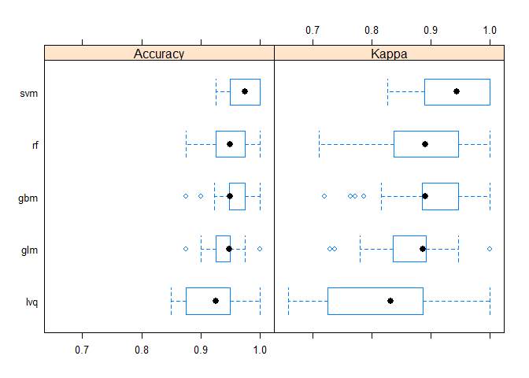
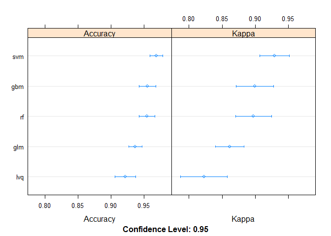

breast cancer wisconsin (Dx)
================
Rich Chien
November 21, 2016

Get input data
--------------

``` r
set.seed(7)
library(dplyr)
library(ggplot2)
library(caret)

df <- read.csv("./data.csv")

# delete id and X columns
df <- df %>%
  select(-id, -X)
```

Setup train and test sets
-------------------------

``` r
# take random 70% to train
index <- sample(1:nrow(df),size = 0.7*nrow(df)) 
train <- df[index, ] 
test <- df[-index, ] 
```

Setup models
------------

``` r
# prepare training control
control <- trainControl(method="repeatedcv", number=10, repeats=3)

# train linear model
m.glm <- train(diagnosis~., data=train, method="glm", trControl=control)

# train LVQ model
m.lvq <- train(diagnosis~., data=train, method="lvq", trControl=control)

# train GBM model
m.gbm <- train(diagnosis~., data=train, method="gbm", trControl=control, verbose=FALSE)

# train SVM model
m.svm <- train(diagnosis~., data=train, method="svmRadial", trControl=control)

# train rf model
m.rf <- train(diagnosis~., data=train, method="rf", trControl=control)

# collect resamples
results <- resamples(list(glm=m.glm, lvq=m.lvq, gbm=m.gbm, svm=m.svm, rf=m.rf))

# summarize 
summary(results)
```

    ## 
    ## Call:
    ## summary.resamples(object = results)
    ## 
    ## Models: glm, lvq, gbm, svm, rf 
    ## Number of resamples: 30 
    ## 
    ## Accuracy 
    ##      Min. 1st Qu. Median   Mean 3rd Qu. Max. NA's
    ## glm 0.875  0.9250 0.9487 0.9364  0.9500    1    0
    ## lvq 0.850  0.8806 0.9250 0.9213  0.9500    1    0
    ## gbm 0.875  0.9487 0.9500 0.9548  0.9750    1    0
    ## svm 0.925  0.9500 0.9750 0.9682  0.9938    1    0
    ## rf  0.875  0.9309 0.9500 0.9540  0.9750    1    0
    ## 
    ## Kappa 
    ##       Min. 1st Qu. Median   Mean 3rd Qu. Max. NA's
    ## glm 0.7297  0.8360 0.8864 0.8614  0.8915    1    0
    ## lvq 0.6591  0.7349 0.8324 0.8225  0.8864    1    0
    ## gbm 0.7207  0.8847 0.8901 0.8996  0.9459    1    0
    ## svm 0.8266  0.8886 0.9441 0.9293  0.9865    1    0
    ## rf  0.7110  0.8500 0.8901 0.8973  0.9455    1    0

``` r
bwplot(results)
```



``` r
dotplot(results)
```



``` r
# predict test set using model
pred.svm <- predict(m.svm, test)

# confusion matrix
confusionMatrix(pred.svm, test$diagnosis)
```

    ## $positive
    ## [1] "B"
    ## 
    ## $table
    ##           Reference
    ## Prediction  B  M
    ##          B 97  1
    ##          M  1 72
    ## 
    ## $overall
    ##       Accuracy          Kappa  AccuracyLower  AccuracyUpper   AccuracyNull 
    ##   9.883041e-01   9.760973e-01   9.583909e-01   9.985804e-01   5.730994e-01 
    ## AccuracyPValue  McnemarPValue 
    ##   3.722127e-38   1.000000e+00 
    ## 
    ## $byClass
    ##          Sensitivity          Specificity       Pos Pred Value 
    ##            0.9897959            0.9863014            0.9897959 
    ##       Neg Pred Value            Precision               Recall 
    ##            0.9863014            0.9897959            0.9897959 
    ##                   F1           Prevalence       Detection Rate 
    ##            0.9897959            0.5730994            0.5672515 
    ## Detection Prevalence    Balanced Accuracy 
    ##            0.5730994            0.9880486 
    ## 
    ## $mode
    ## [1] "sens_spec"
    ## 
    ## $dots
    ## list()
    ## 
    ## attr(,"class")
    ## [1] "confusionMatrix"
